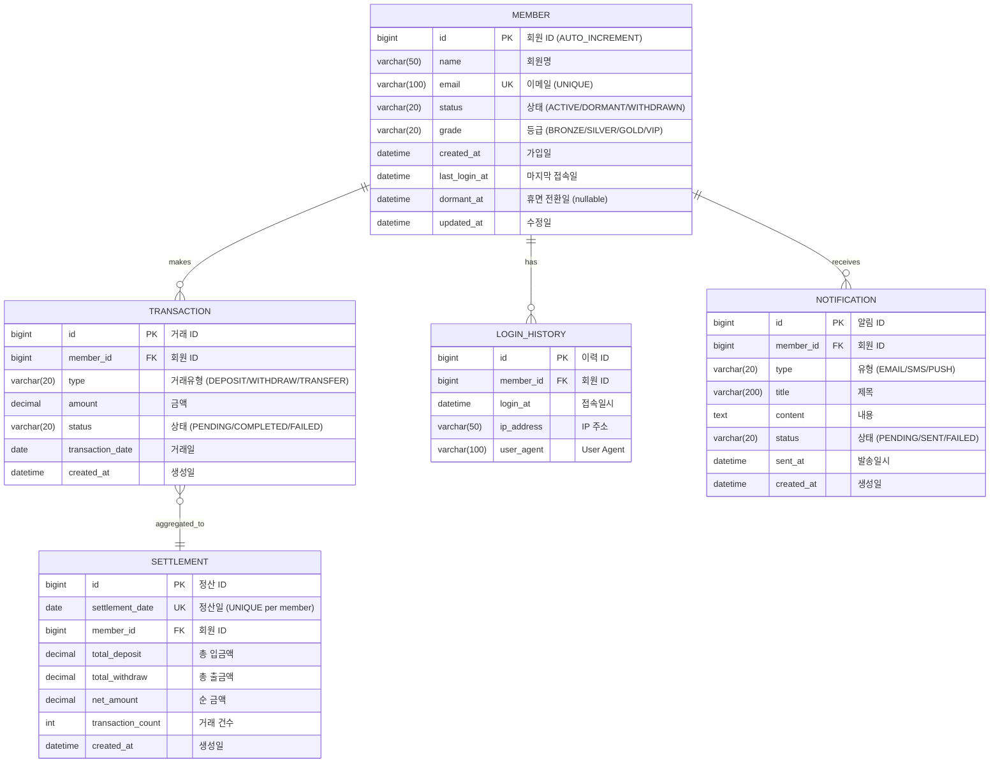
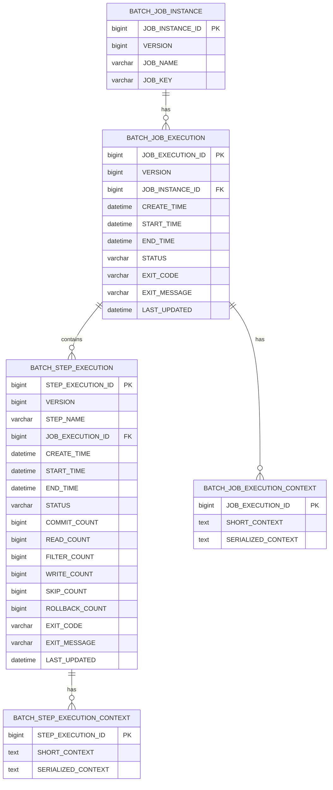

# BatchFlow 데이터베이스 스키마 및 초기 데이터

---

## 문서 정보

| 항목 | 내용 |
|------|------|
| 버전 | 1.0.0 |
| DB | H2 (개발/테스트), MySQL 8.0 (운영) |
| 목적 | 배치 학습용 테스트 데이터 제공 |

---

## 1. 데이터 규모 설계

### 1.1 규모 산정 원칙

배치 학습을 위해서는 **의미 있는 성능 차이**를 체감할 수 있는 규모가 필요합니다.

| 테이블 | 기본 규모 | 목적 |
|--------|----------|------|
| member | 100,000건 | 대용량 처리 체감, Partitioning 테스트 |
| transaction | 500,000건 | 일일 정산 배치 테스트 |
| settlement | 0건 (배치 생성) | 정산 결과 저장 |
| notification | 0건 (배치 생성) | 알림 발송 결과 저장 |
| login_history | 300,000건 | 휴면 회원 판별 기준 |

### 1.2 데이터 특성

```
┌─────────────────────────────────────────────────────────────────┐
│                     테스트 데이터 분포                           │
├─────────────────────────────────────────────────────────────────┤
│                                                                  │
│  member (100,000건)                                             │
│  ├── ACTIVE: 70,000건 (70%)                                     │
│  │   ├── 최근 접속 (1년 이내): 50,000건                         │
│  │   └── 장기 미접속 (1년 이상): 20,000건 → 휴면 전환 대상     │
│  ├── DORMANT: 25,000건 (25%)                                    │
│  └── WITHDRAWN: 5,000건 (5%)                                    │
│                                                                  │
│  transaction (500,000건)                                        │
│  ├── 오늘: 5,000건 (일일 정산 대상)                             │
│  ├── 이번 달: 100,000건                                         │
│  └── 과거: 395,000건                                            │
│                                                                  │
└─────────────────────────────────────────────────────────────────┘
```

---

## 2. ERD (Entity Relationship Diagram)

### 2.1 전체 ERD



### 2.2 Spring Batch 메타데이터 테이블



---

## 3. DDL (테이블 생성 스크립트)

### 3.1 비즈니스 테이블

```sql
-- schema.sql (src/main/resources)

-- 회원 테이블
CREATE TABLE IF NOT EXISTS member (
    id BIGINT AUTO_INCREMENT PRIMARY KEY COMMENT '회원 ID',
    name VARCHAR(50) NOT NULL COMMENT '회원명',
    email VARCHAR(100) NOT NULL UNIQUE COMMENT '이메일',
    status VARCHAR(20) NOT NULL DEFAULT 'ACTIVE' COMMENT '상태',
    grade VARCHAR(20) NOT NULL DEFAULT 'BRONZE' COMMENT '등급',
    created_at DATETIME NOT NULL DEFAULT CURRENT_TIMESTAMP COMMENT '가입일',
    last_login_at DATETIME COMMENT '마지막 접속일',
    dormant_at DATETIME COMMENT '휴면 전환일',
    updated_at DATETIME DEFAULT CURRENT_TIMESTAMP ON UPDATE CURRENT_TIMESTAMP COMMENT '수정일',
    
    INDEX idx_member_status (status),
    INDEX idx_member_last_login (last_login_at),
    INDEX idx_member_status_login (status, last_login_at)
) ENGINE=InnoDB DEFAULT CHARSET=utf8mb4 COMMENT='회원';

-- 거래 테이블
CREATE TABLE IF NOT EXISTS transaction (
    id BIGINT AUTO_INCREMENT PRIMARY KEY COMMENT '거래 ID',
    member_id BIGINT NOT NULL COMMENT '회원 ID',
    type VARCHAR(20) NOT NULL COMMENT '거래유형',
    amount DECIMAL(15, 2) NOT NULL COMMENT '금액',
    status VARCHAR(20) NOT NULL DEFAULT 'COMPLETED' COMMENT '상태',
    transaction_date DATE NOT NULL COMMENT '거래일',
    created_at DATETIME NOT NULL DEFAULT CURRENT_TIMESTAMP COMMENT '생성일',
    
    INDEX idx_transaction_member (member_id),
    INDEX idx_transaction_date (transaction_date),
    INDEX idx_transaction_member_date (member_id, transaction_date),
    FOREIGN KEY (member_id) REFERENCES member(id)
) ENGINE=InnoDB DEFAULT CHARSET=utf8mb4 COMMENT='거래';

-- 정산 테이블
CREATE TABLE IF NOT EXISTS settlement (
    id BIGINT AUTO_INCREMENT PRIMARY KEY COMMENT '정산 ID',
    settlement_date DATE NOT NULL COMMENT '정산일',
    member_id BIGINT NOT NULL COMMENT '회원 ID',
    total_deposit DECIMAL(15, 2) NOT NULL DEFAULT 0 COMMENT '총 입금액',
    total_withdraw DECIMAL(15, 2) NOT NULL DEFAULT 0 COMMENT '총 출금액',
    net_amount DECIMAL(15, 2) NOT NULL DEFAULT 0 COMMENT '순 금액',
    transaction_count INT NOT NULL DEFAULT 0 COMMENT '거래 건수',
    created_at DATETIME NOT NULL DEFAULT CURRENT_TIMESTAMP COMMENT '생성일',
    
    UNIQUE INDEX idx_settlement_date_member (settlement_date, member_id),
    INDEX idx_settlement_member (member_id),
    FOREIGN KEY (member_id) REFERENCES member(id)
) ENGINE=InnoDB DEFAULT CHARSET=utf8mb4 COMMENT='정산';

-- 로그인 이력 테이블
CREATE TABLE IF NOT EXISTS login_history (
    id BIGINT AUTO_INCREMENT PRIMARY KEY COMMENT '이력 ID',
    member_id BIGINT NOT NULL COMMENT '회원 ID',
    login_at DATETIME NOT NULL COMMENT '접속일시',
    ip_address VARCHAR(50) COMMENT 'IP 주소',
    user_agent VARCHAR(200) COMMENT 'User Agent',
    
    INDEX idx_login_member (member_id),
    INDEX idx_login_at (login_at),
    FOREIGN KEY (member_id) REFERENCES member(id)
) ENGINE=InnoDB DEFAULT CHARSET=utf8mb4 COMMENT='로그인 이력';

-- 알림 테이블
CREATE TABLE IF NOT EXISTS notification (
    id BIGINT AUTO_INCREMENT PRIMARY KEY COMMENT '알림 ID',
    member_id BIGINT NOT NULL COMMENT '회원 ID',
    type VARCHAR(20) NOT NULL COMMENT '유형',
    title VARCHAR(200) NOT NULL COMMENT '제목',
    content TEXT COMMENT '내용',
    status VARCHAR(20) NOT NULL DEFAULT 'PENDING' COMMENT '상태',
    sent_at DATETIME COMMENT '발송일시',
    created_at DATETIME NOT NULL DEFAULT CURRENT_TIMESTAMP COMMENT '생성일',
    
    INDEX idx_notification_member (member_id),
    INDEX idx_notification_status (status),
    FOREIGN KEY (member_id) REFERENCES member(id)
) ENGINE=InnoDB DEFAULT CHARSET=utf8mb4 COMMENT='알림';
```

### 3.2 H2 호환 DDL

```sql
-- schema-h2.sql (H2 전용)

CREATE TABLE IF NOT EXISTS member (
    id BIGINT AUTO_INCREMENT PRIMARY KEY,
    name VARCHAR(50) NOT NULL,
    email VARCHAR(100) NOT NULL UNIQUE,
    status VARCHAR(20) NOT NULL DEFAULT 'ACTIVE',
    grade VARCHAR(20) NOT NULL DEFAULT 'BRONZE',
    created_at TIMESTAMP NOT NULL DEFAULT CURRENT_TIMESTAMP,
    last_login_at TIMESTAMP,
    dormant_at TIMESTAMP,
    updated_at TIMESTAMP DEFAULT CURRENT_TIMESTAMP
);

CREATE INDEX IF NOT EXISTS idx_member_status ON member(status);
CREATE INDEX IF NOT EXISTS idx_member_last_login ON member(last_login_at);
CREATE INDEX IF NOT EXISTS idx_member_status_login ON member(status, last_login_at);

CREATE TABLE IF NOT EXISTS transaction (
    id BIGINT AUTO_INCREMENT PRIMARY KEY,
    member_id BIGINT NOT NULL,
    type VARCHAR(20) NOT NULL,
    amount DECIMAL(15, 2) NOT NULL,
    status VARCHAR(20) NOT NULL DEFAULT 'COMPLETED',
    transaction_date DATE NOT NULL,
    created_at TIMESTAMP NOT NULL DEFAULT CURRENT_TIMESTAMP,
    FOREIGN KEY (member_id) REFERENCES member(id)
);

CREATE INDEX IF NOT EXISTS idx_transaction_member ON transaction(member_id);
CREATE INDEX IF NOT EXISTS idx_transaction_date ON transaction(transaction_date);

CREATE TABLE IF NOT EXISTS settlement (
    id BIGINT AUTO_INCREMENT PRIMARY KEY,
    settlement_date DATE NOT NULL,
    member_id BIGINT NOT NULL,
    total_deposit DECIMAL(15, 2) NOT NULL DEFAULT 0,
    total_withdraw DECIMAL(15, 2) NOT NULL DEFAULT 0,
    net_amount DECIMAL(15, 2) NOT NULL DEFAULT 0,
    transaction_count INT NOT NULL DEFAULT 0,
    created_at TIMESTAMP NOT NULL DEFAULT CURRENT_TIMESTAMP,
    FOREIGN KEY (member_id) REFERENCES member(id)
);

CREATE UNIQUE INDEX IF NOT EXISTS idx_settlement_date_member ON settlement(settlement_date, member_id);

CREATE TABLE IF NOT EXISTS login_history (
    id BIGINT AUTO_INCREMENT PRIMARY KEY,
    member_id BIGINT NOT NULL,
    login_at TIMESTAMP NOT NULL,
    ip_address VARCHAR(50),
    user_agent VARCHAR(200),
    FOREIGN KEY (member_id) REFERENCES member(id)
);

CREATE TABLE IF NOT EXISTS notification (
    id BIGINT AUTO_INCREMENT PRIMARY KEY,
    member_id BIGINT NOT NULL,
    type VARCHAR(20) NOT NULL,
    title VARCHAR(200) NOT NULL,
    content CLOB,
    status VARCHAR(20) NOT NULL DEFAULT 'PENDING',
    sent_at TIMESTAMP,
    created_at TIMESTAMP NOT NULL DEFAULT CURRENT_TIMESTAMP,
    FOREIGN KEY (member_id) REFERENCES member(id)
);
```

---

## 4. 초기 데이터 INSERT 스크립트

### 4.1 회원 데이터 (100,000건)

```sql
-- data.sql (src/main/resources)
-- H2 데이터베이스용 초기 데이터

-- =====================================================
-- 회원 데이터 생성 (100,000건)
-- =====================================================

-- 1. ACTIVE 회원 - 최근 접속 (50,000건)
-- 마지막 접속: 최근 1년 이내
INSERT INTO member (name, email, status, grade, created_at, last_login_at)
SELECT 
    CONCAT('회원', LPAD(CAST(x AS VARCHAR), 6, '0')),
    CONCAT('user', LPAD(CAST(x AS VARCHAR), 6, '0'), '@example.com'),
    'ACTIVE',
    CASE 
        WHEN MOD(x, 100) < 50 THEN 'BRONZE'
        WHEN MOD(x, 100) < 80 THEN 'SILVER'
        WHEN MOD(x, 100) < 95 THEN 'GOLD'
        ELSE 'VIP'
    END,
    DATEADD('DAY', -FLOOR(RAND() * 1095), CURRENT_DATE()),  -- 최근 3년 내 가입
    DATEADD('DAY', -FLOOR(RAND() * 365), CURRENT_DATE())    -- 최근 1년 내 접속
FROM SYSTEM_RANGE(1, 50000) AS t(x);

-- 2. ACTIVE 회원 - 장기 미접속, 휴면 전환 대상 (20,000건)
-- 마지막 접속: 1년 ~ 3년 전
INSERT INTO member (name, email, status, grade, created_at, last_login_at)
SELECT 
    CONCAT('회원', LPAD(CAST(x + 50000 AS VARCHAR), 6, '0')),
    CONCAT('user', LPAD(CAST(x + 50000 AS VARCHAR), 6, '0'), '@example.com'),
    'ACTIVE',
    CASE 
        WHEN MOD(x, 100) < 60 THEN 'BRONZE'
        WHEN MOD(x, 100) < 85 THEN 'SILVER'
        WHEN MOD(x, 100) < 97 THEN 'GOLD'
        ELSE 'VIP'
    END,
    DATEADD('DAY', -FLOOR(RAND() * 1095 + 365), CURRENT_DATE()),  -- 1~4년 전 가입
    DATEADD('DAY', -FLOOR(RAND() * 730 + 365), CURRENT_DATE())     -- 1~3년 전 접속
FROM SYSTEM_RANGE(1, 20000) AS t(x);

-- 3. DORMANT 회원 (25,000건)
INSERT INTO member (name, email, status, grade, created_at, last_login_at, dormant_at)
SELECT 
    CONCAT('회원', LPAD(CAST(x + 70000 AS VARCHAR), 6, '0')),
    CONCAT('user', LPAD(CAST(x + 70000 AS VARCHAR), 6, '0'), '@example.com'),
    'DORMANT',
    CASE 
        WHEN MOD(x, 100) < 70 THEN 'BRONZE'
        WHEN MOD(x, 100) < 90 THEN 'SILVER'
        ELSE 'GOLD'
    END,
    DATEADD('DAY', -FLOOR(RAND() * 1460 + 365), CURRENT_DATE()),  -- 1~5년 전 가입
    DATEADD('DAY', -FLOOR(RAND() * 730 + 730), CURRENT_DATE()),   -- 2~4년 전 접속
    DATEADD('DAY', -FLOOR(RAND() * 365), CURRENT_DATE())          -- 휴면 전환일
FROM SYSTEM_RANGE(1, 25000) AS t(x);

-- 4. WITHDRAWN 회원 (5,000건)
INSERT INTO member (name, email, status, grade, created_at, last_login_at)
SELECT 
    CONCAT('회원', LPAD(CAST(x + 95000 AS VARCHAR), 6, '0')),
    CONCAT('user', LPAD(CAST(x + 95000 AS VARCHAR), 6, '0'), '@example.com'),
    'WITHDRAWN',
    'BRONZE',
    DATEADD('DAY', -FLOOR(RAND() * 1825), CURRENT_DATE()),  -- 최근 5년 내
    DATEADD('DAY', -FLOOR(RAND() * 365 + 30), CURRENT_DATE())
FROM SYSTEM_RANGE(1, 5000) AS t(x);


-- =====================================================
-- 거래 데이터 생성 (500,000건)
-- =====================================================

-- 1. 오늘 거래 (5,000건) - 일일 정산 대상
INSERT INTO transaction (member_id, type, amount, status, transaction_date, created_at)
SELECT 
    FLOOR(RAND() * 70000) + 1,  -- ACTIVE 회원만
    CASE 
        WHEN MOD(x, 3) = 0 THEN 'DEPOSIT'
        WHEN MOD(x, 3) = 1 THEN 'WITHDRAW'
        ELSE 'TRANSFER'
    END,
    ROUND(RAND() * 1000000 + 10000, 2),  -- 10,000 ~ 1,010,000
    'COMPLETED',
    CURRENT_DATE(),
    CURRENT_TIMESTAMP()
FROM SYSTEM_RANGE(1, 5000) AS t(x);

-- 2. 이번 달 거래 (95,000건)
INSERT INTO transaction (member_id, type, amount, status, transaction_date, created_at)
SELECT 
    FLOOR(RAND() * 70000) + 1,
    CASE 
        WHEN MOD(x, 3) = 0 THEN 'DEPOSIT'
        WHEN MOD(x, 3) = 1 THEN 'WITHDRAW'
        ELSE 'TRANSFER'
    END,
    ROUND(RAND() * 1000000 + 10000, 2),
    CASE WHEN MOD(x, 100) < 98 THEN 'COMPLETED' ELSE 'FAILED' END,
    DATEADD('DAY', -FLOOR(RAND() * 30), CURRENT_DATE()),
    DATEADD('DAY', -FLOOR(RAND() * 30), CURRENT_TIMESTAMP())
FROM SYSTEM_RANGE(1, 95000) AS t(x);

-- 3. 과거 거래 (400,000건)
INSERT INTO transaction (member_id, type, amount, status, transaction_date, created_at)
SELECT 
    FLOOR(RAND() * 95000) + 1,  -- 탈퇴 회원 제외
    CASE 
        WHEN MOD(x, 3) = 0 THEN 'DEPOSIT'
        WHEN MOD(x, 3) = 1 THEN 'WITHDRAW'
        ELSE 'TRANSFER'
    END,
    ROUND(RAND() * 500000 + 5000, 2),
    CASE WHEN MOD(x, 100) < 97 THEN 'COMPLETED' ELSE 'FAILED' END,
    DATEADD('DAY', -FLOOR(RAND() * 335 + 30), CURRENT_DATE()),
    DATEADD('DAY', -FLOOR(RAND() * 335 + 30), CURRENT_TIMESTAMP())
FROM SYSTEM_RANGE(1, 400000) AS t(x);


-- =====================================================
-- 로그인 이력 데이터 생성 (300,000건)
-- =====================================================

INSERT INTO login_history (member_id, login_at, ip_address, user_agent)
SELECT 
    FLOOR(RAND() * 95000) + 1,
    DATEADD('MINUTE', -FLOOR(RAND() * 525600), CURRENT_TIMESTAMP()),  -- 최근 1년
    CONCAT(
        CAST(FLOOR(RAND() * 255) AS VARCHAR), '.',
        CAST(FLOOR(RAND() * 255) AS VARCHAR), '.',
        CAST(FLOOR(RAND() * 255) AS VARCHAR), '.',
        CAST(FLOOR(RAND() * 255) AS VARCHAR)
    ),
    CASE 
        WHEN MOD(x, 4) = 0 THEN 'Mozilla/5.0 (Windows NT 10.0; Win64; x64) Chrome/120.0'
        WHEN MOD(x, 4) = 1 THEN 'Mozilla/5.0 (Macintosh; Intel Mac OS X 10_15_7) Safari/17.0'
        WHEN MOD(x, 4) = 2 THEN 'Mozilla/5.0 (iPhone; CPU iPhone OS 17_0) Mobile/15E148'
        ELSE 'Mozilla/5.0 (Linux; Android 14) Chrome/120.0 Mobile'
    END
FROM SYSTEM_RANGE(1, 300000) AS t(x);
```

### 4.2 소규모 테스트 데이터 (1,000건)

빠른 테스트를 위한 소규모 데이터셋:

```sql
-- data-small.sql (테스트용 소규모 데이터)

-- 회원 1,000건
INSERT INTO member (name, email, status, grade, created_at, last_login_at)
SELECT 
    CONCAT('테스트회원', LPAD(CAST(x AS VARCHAR), 4, '0')),
    CONCAT('test', LPAD(CAST(x AS VARCHAR), 4, '0'), '@test.com'),
    CASE 
        WHEN MOD(x, 10) < 7 THEN 'ACTIVE'
        WHEN MOD(x, 10) < 9 THEN 'DORMANT'
        ELSE 'WITHDRAWN'
    END,
    CASE 
        WHEN MOD(x, 4) = 0 THEN 'BRONZE'
        WHEN MOD(x, 4) = 1 THEN 'SILVER'
        WHEN MOD(x, 4) = 2 THEN 'GOLD'
        ELSE 'VIP'
    END,
    DATEADD('DAY', -FLOOR(RAND() * 730), CURRENT_DATE()),
    CASE 
        WHEN MOD(x, 5) < 3 THEN DATEADD('DAY', -FLOOR(RAND() * 180), CURRENT_DATE())
        ELSE DATEADD('DAY', -FLOOR(RAND() * 730 + 365), CURRENT_DATE())
    END
FROM SYSTEM_RANGE(1, 1000) AS t(x);

-- 거래 5,000건
INSERT INTO transaction (member_id, type, amount, status, transaction_date)
SELECT 
    MOD(x, 1000) + 1,
    CASE MOD(x, 3) WHEN 0 THEN 'DEPOSIT' WHEN 1 THEN 'WITHDRAW' ELSE 'TRANSFER' END,
    ROUND(RAND() * 100000 + 1000, 2),
    CASE WHEN MOD(x, 50) = 0 THEN 'FAILED' ELSE 'COMPLETED' END,
    DATEADD('DAY', -FLOOR(RAND() * 90), CURRENT_DATE())
FROM SYSTEM_RANGE(1, 5000) AS t(x);
```

---

## 5. 프로파일별 설정

### 5.1 application.yml

```yaml
# application.yml (공통)
spring:
  profiles:
    active: local
  batch:
    job:
      enabled: false  # 자동 실행 비활성화
    jdbc:
      initialize-schema: always

---
# application-local.yml
spring:
  config:
    activate:
      on-profile: local
  datasource:
    url: jdbc:h2:mem:batchflow;MODE=MySQL;DB_CLOSE_DELAY=-1
    username: sa
    password: 
    driver-class-name: org.h2.Driver
  h2:
    console:
      enabled: true
      path: /h2-console
  sql:
    init:
      mode: always
      schema-locations: classpath:schema-h2.sql
      data-locations: classpath:data.sql
  jpa:
    hibernate:
      ddl-auto: none
    show-sql: true
    properties:
      hibernate:
        format_sql: true

---
# application-test.yml
spring:
  config:
    activate:
      on-profile: test
  datasource:
    url: jdbc:h2:mem:testdb;MODE=MySQL;DB_CLOSE_DELAY=-1
    username: sa
    password:
  sql:
    init:
      mode: always
      schema-locations: classpath:schema-h2.sql
      data-locations: classpath:data-small.sql  # 소규모 데이터
  jpa:
    hibernate:
      ddl-auto: none
    show-sql: false
```

---

## 6. 데이터 검증 쿼리

### 6.1 데이터 현황 확인

```sql
-- 회원 현황
SELECT 
    status,
    grade,
    COUNT(*) as count,
    MIN(last_login_at) as oldest_login,
    MAX(last_login_at) as latest_login
FROM member
GROUP BY status, grade
ORDER BY status, grade;

-- 휴면 전환 대상 확인 (1년 이상 미접속 ACTIVE 회원)
SELECT COUNT(*) as dormant_target_count
FROM member
WHERE status = 'ACTIVE'
  AND last_login_at < DATEADD('YEAR', -1, CURRENT_DATE());

-- 거래 현황
SELECT 
    transaction_date,
    type,
    COUNT(*) as count,
    SUM(amount) as total_amount
FROM transaction
WHERE status = 'COMPLETED'
GROUP BY transaction_date, type
ORDER BY transaction_date DESC, type
LIMIT 20;

-- 일일 정산 대상 (오늘 거래)
SELECT 
    member_id,
    SUM(CASE WHEN type = 'DEPOSIT' THEN amount ELSE 0 END) as total_deposit,
    SUM(CASE WHEN type = 'WITHDRAW' THEN amount ELSE 0 END) as total_withdraw,
    COUNT(*) as tx_count
FROM transaction
WHERE transaction_date = CURRENT_DATE()
  AND status = 'COMPLETED'
GROUP BY member_id
HAVING COUNT(*) > 0;
```

### 6.2 배치 실행 후 검증

```sql
-- 휴면 전환 결과 확인
SELECT 
    status,
    COUNT(*) as count,
    MAX(dormant_at) as latest_dormant
FROM member
WHERE dormant_at IS NOT NULL
GROUP BY status;

-- 정산 결과 확인
SELECT 
    settlement_date,
    COUNT(*) as member_count,
    SUM(total_deposit) as sum_deposit,
    SUM(total_withdraw) as sum_withdraw,
    SUM(net_amount) as sum_net
FROM settlement
GROUP BY settlement_date
ORDER BY settlement_date DESC;
```

---

## 7. 데이터 시나리오별 활용

### 7.1 Step별 테스트 데이터 활용

| Step | 필요 데이터 | 검증 포인트 |
|------|------------|------------|
| 1-8 (기초) | member 100건 | Job 실행, 파라미터 처리 |
| 9-14 (Reader) | member 10,000건 | 페이징, 커서 성능 비교 |
| 15-18 (휴면전환) | ACTIVE 회원 중 20,000건 | 휴면 전환 정확성 |
| 19-26 (에러처리) | 일부 오류 데이터 포함 | Skip/Retry 동작 |
| 27-35 (성능) | 100,000건 전체 | 처리 시간 측정 |
| 43-46 (정산) | 오늘 거래 5,000건 | 집계 정확성 |
| 47-50 (알림) | ACTIVE 회원 70,000건 | 대량 발송 처리 |

### 7.2 성능 테스트 시나리오

```sql
-- Chunk Size별 성능 비교용 데이터
-- 100, 500, 1000, 5000 Chunk Size로 테스트

-- 실행 시간 기록
SELECT 
    JOB_NAME,
    STEP_NAME,
    START_TIME,
    END_TIME,
    TIMESTAMPDIFF(SECOND, START_TIME, END_TIME) as duration_seconds,
    READ_COUNT,
    WRITE_COUNT
FROM BATCH_JOB_EXECUTION je
JOIN BATCH_STEP_EXECUTION se ON je.JOB_EXECUTION_ID = se.JOB_EXECUTION_ID
JOIN BATCH_JOB_INSTANCE ji ON je.JOB_INSTANCE_ID = ji.JOB_INSTANCE_ID
ORDER BY je.CREATE_TIME DESC;
```

---

## 8. 주의사항

### 8.1 H2 메모리 DB 특성

```yaml
# DB_CLOSE_DELAY=-1: JVM이 종료되기 전까지 DB 유지
url: jdbc:h2:mem:batchflow;MODE=MySQL;DB_CLOSE_DELAY=-1

# MODE=MySQL: MySQL 호환 모드 (문법 호환성)
```

### 8.2 대용량 INSERT 시 주의

```sql
-- H2에서 대용량 INSERT 시 메모리 부족 가능
-- JVM 옵션: -Xmx512m 이상 권장

-- 또는 배치로 나눠서 INSERT
-- SYSTEM_RANGE를 10,000건씩 나눠서 실행
```

### 8.3 운영 환경 마이그레이션

```sql
-- MySQL로 마이그레이션 시 문법 차이 주의
-- H2: DATEADD('DAY', -1, CURRENT_DATE())
-- MySQL: DATE_SUB(CURDATE(), INTERVAL 1 DAY)

-- H2: SYSTEM_RANGE(1, 100)
-- MySQL: 별도의 숫자 테이블 또는 재귀 CTE 사용
```

---

## 부록: 엔티티 클래스

### Member.java

```java
@Entity
@Table(name = "member")
@Getter
@NoArgsConstructor(access = AccessLevel.PROTECTED)
public class Member {
    
    @Id
    @GeneratedValue(strategy = GenerationType.IDENTITY)
    private Long id;
    
    @Column(nullable = false, length = 50)
    private String name;
    
    @Column(nullable = false, unique = true, length = 100)
    private String email;
    
    @Enumerated(EnumType.STRING)
    @Column(nullable = false, length = 20)
    private MemberStatus status;
    
    @Enumerated(EnumType.STRING)
    @Column(nullable = false, length = 20)
    private MemberGrade grade;
    
    @Column(name = "created_at", nullable = false)
    private LocalDateTime createdAt;
    
    @Column(name = "last_login_at")
    private LocalDateTime lastLoginAt;
    
    @Column(name = "dormant_at")
    private LocalDateTime dormantAt;
    
    @Column(name = "updated_at")
    private LocalDateTime updatedAt;
    
    @Builder
    public Member(String name, String email, MemberStatus status, 
                  MemberGrade grade, LocalDateTime lastLoginAt) {
        this.name = name;
        this.email = email;
        this.status = status != null ? status : MemberStatus.ACTIVE;
        this.grade = grade != null ? grade : MemberGrade.BRONZE;
        this.createdAt = LocalDateTime.now();
        this.lastLoginAt = lastLoginAt;
    }
    
    public void updateToDormant() {
        this.status = MemberStatus.DORMANT;
        this.dormantAt = LocalDateTime.now();
        this.updatedAt = LocalDateTime.now();
    }
}

public enum MemberStatus {
    ACTIVE, DORMANT, WITHDRAWN
}

public enum MemberGrade {
    BRONZE, SILVER, GOLD, VIP
}
```
